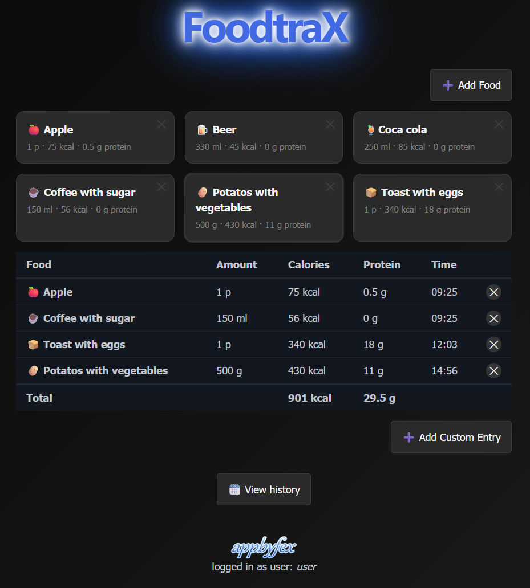
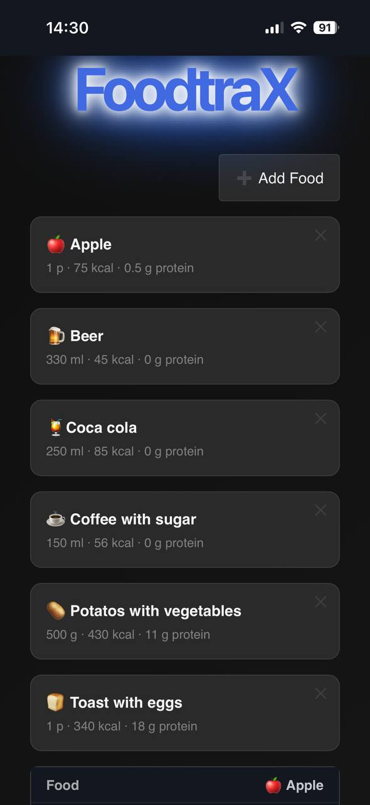
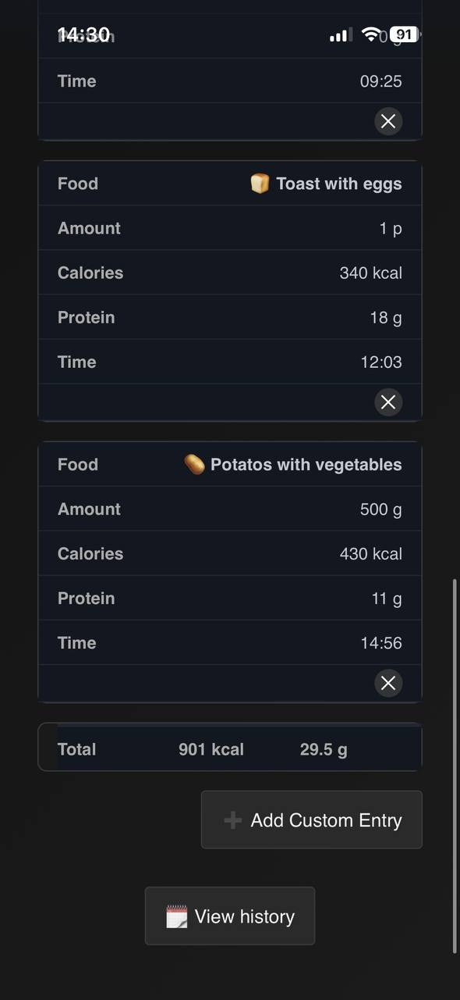
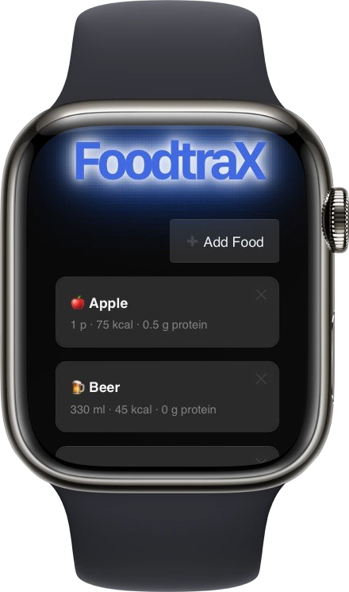

# FoodTrax

FoodTrax is a lightweight food tracking application for recording food and reviewing consumption history. It runs as a Blazor interactive server application with SQLite storage.

The interface is intended to work across desktop browsers, phones, and Apple Watch-sized experiences.

## Screenshots









## Run with Docker Compose

Docker and Docker Compose are required. The Compose configuration uses the external `virtual-network` network, so create it once if it does not already exist:

```bash
docker network create virtual-network
```

Build and start FoodTrax from the repository root:

```bash
docker compose up --build -d
```

Open the application at [http://localhost:8080](http://localhost:8080). The SQLite database is persisted in the local `data` directory, which is mounted into the container at `/app/data`.

To stop the application:

```bash
docker compose down
```

To follow application logs:

```bash
docker compose logs -f foodtrax
```

## Development

The project targets .NET 10 and can also be run with the .NET SDK:

```bash
dotnet run --project Foodtrax/Foodtrax.csproj
```

The Docker image is configured to build from the repository root and publishes the application in Release mode.